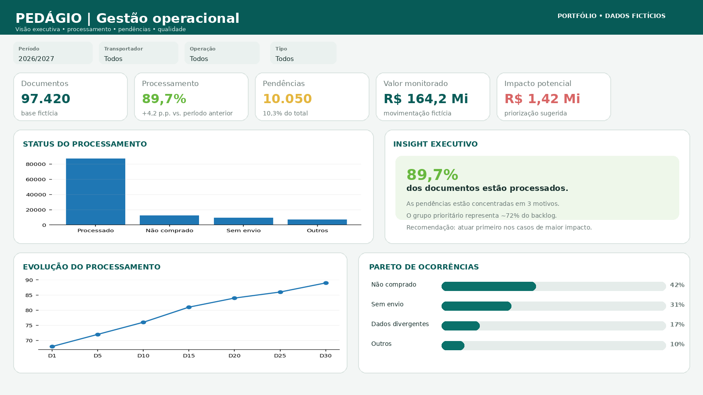
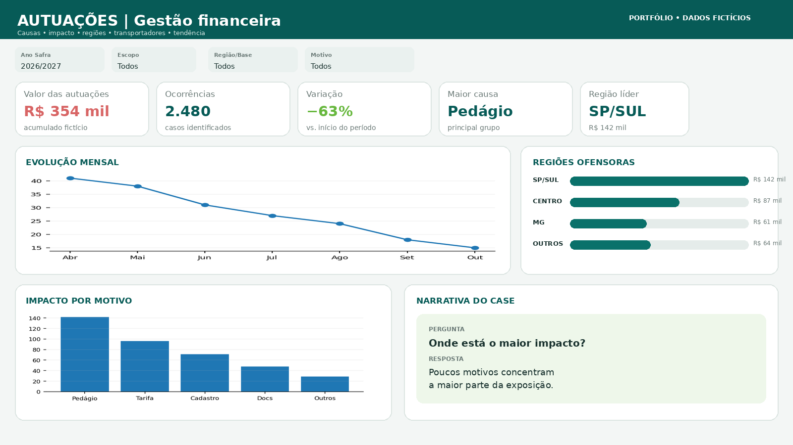
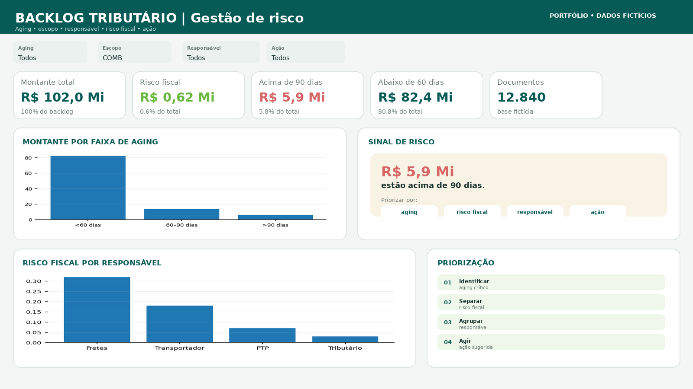
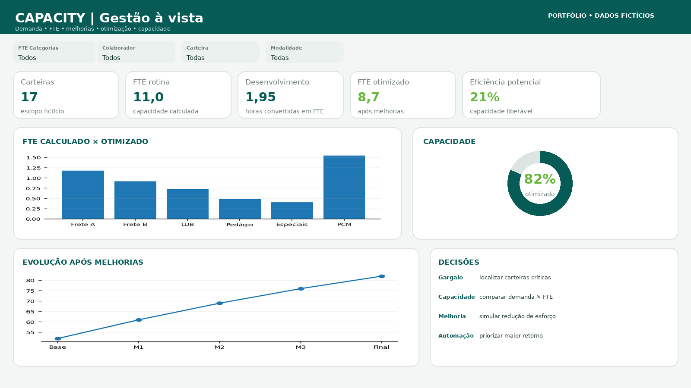

# 📊 Wesley Marques

### Data & Business Intelligence

> Transformando dados operacionais em insights para tomada de decisão.

Profissional de **Business Intelligence e Analytics**, com experiência no desenvolvimento de soluções para análise de dados, planejamento, eficiência operacional e automação de processos.

Minha abordagem combina **visão de negócio + dados + tecnologia**, buscando transformar problemas operacionais em indicadores claros e acionáveis.

---

## 🚀 Projetos em destaque

### 🚛 Pedágio & Fretes

**Foco:** Operações, processamento e identificação de pendências.

**Tecnologias:** `Power BI` `DAX` `Power Query` `Data Modeling`

[→ Ver case completo](./cases/pedagio-fretes.md)

---

### 💰 Autuações

**Foco:** Impacto financeiro, causas, regiões e identificação de pontos críticos.

**Tecnologias:** `Power BI` `DAX` `Data Analytics`

[→ Ver case completo](./cases/autuacoes.md)

---

### ⚠️ Backlog Tributário

**Foco:** Aging, risco fiscal, responsáveis e priorização de ações.

**Tecnologias:** `Power BI` `DAX` `Data Modeling`

[→ Ver case completo](./cases/backlog-tributario.md)

---

### 📈 Capacity Management

**Foco:** Demanda, FTE, capacidade operacional e oportunidades de otimização.

**Tecnologias:** `Power BI` `Excel` `Data Modeling`

[→ Ver case completo](./cases/capacity.md)

---

# 🧠 Como eu trabalho

Meu objetivo não é apenas criar dashboards.

Procuro transformar:

**Problema de negócio**  
↓  
**Dados**  
↓  
**Modelo analítico**  
↓  
**Indicadores**  
↓  
**Insight**  
↓  
**Ação**

### Entender → Estruturar → Construir → Validar → Comunicar → Otimizar

Cada projeto busca responder três perguntas:

> **O que está acontecendo?**

> **Por que está acontecendo?**

> **O que podemos fazer a respeito?**

---

# 🛠️ Tech Stack

### 📊 Business Intelligence

`Power BI` `DAX` `Power Query` `Data Modeling`

### 🐍 Dados & Automação

`Python` `SQL` `Excel` `VBA` `Power Automate` `Power Apps`

### ⚙️ Sistemas

`SAP`

---

# 📌 Áreas de aplicação

- Business Intelligence
- Data Analytics
- Planejamento
- Gestão de capacidade
- Análise operacional
- Indicadores de desempenho
- Gestão de backlog
- Análise de risco
- Automação de processos
- Data Visualization

---

# 📄 Portfólio completo

Para uma visão geral dos projetos:

**[→ Visualizar Portfolio BI em PDF](./Portfolio_BI_Wesley_Marques.pdf)**

---

# 🔎 Sobre os projetos

Os dashboards apresentados neste repositório são **projetos demonstrativos**.

Todos os dados, valores, nomes e indicadores foram **fictícios ou generalizados**, preservando a lógica de negócio sem exposição de informações corporativas ou confidenciais.

O objetivo é demonstrar:

- capacidade de estruturação de problemas;
- modelagem e análise de dados;
- construção de indicadores;
- Data Visualization;
- pensamento analítico;
- visão orientada ao negócio.

---

## 📬 Contato

**Wesley Marques**

📍 Piracicaba, SP — Brasil

💼 Data & Business Intelligence

---

⭐ Se você chegou até aqui, obrigado pela visita!

**[GitHub](https://github.com/Wel2000)**
